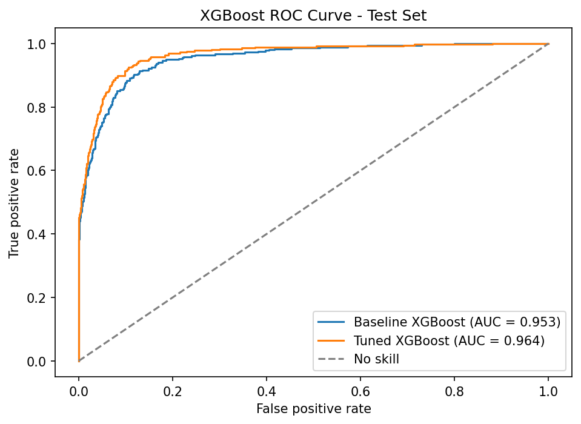
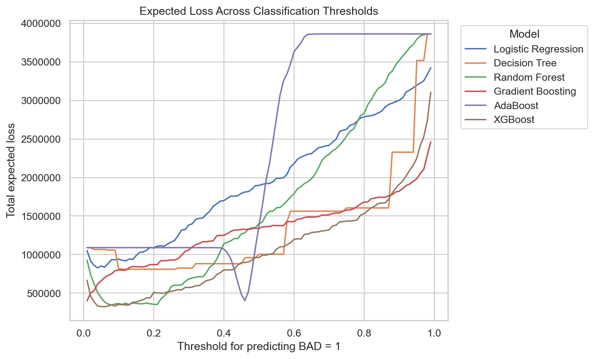
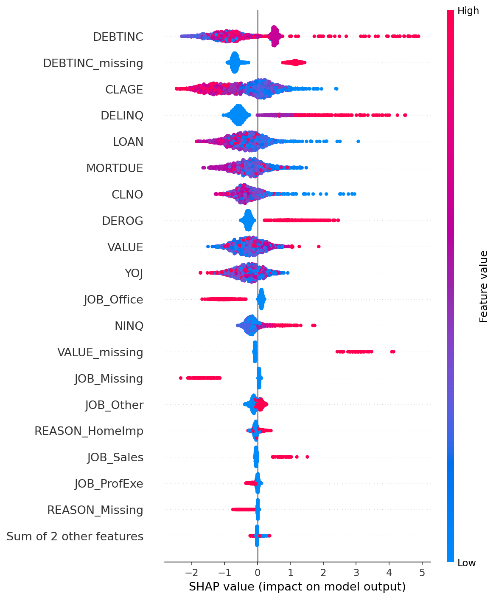

# Loan Default Prediction and Lending Decision Analysis

Portfolio project using the HMEQ home-equity loan dataset to predict loan default risk, compare classification models, and translate model predictions into lending decision costs.

## Project Overview

The target variable is `BAD`:

- `BAD = 1`: borrower defaulted or was severely delinquent
- `BAD = 0`: borrower repaid the loan

The project has two goals:

1. Build predictive models that identify borrowers with elevated default risk.
2. Evaluate how model decisions affect lending losses, not only standard classification metrics.

This makes the project more realistic than a metric-only modelling exercise: in lending, a false negative can expose the bank to credit losses, while a false positive can reject a borrower who would have repaid.

## Business Problem

A lender wants to approve profitable loans while limiting default exposure. Accuracy alone is not enough because the default class is smaller and the cost of different errors is asymmetric.

The analysis therefore evaluates:

- predictive performance: accuracy, precision, recall, F1-score, ROC-AUC
- decision performance: expected loss from false negatives and false positives
- interpretability: feature importance and SHAP explanations for the strongest predictive model

## Data

The dataset contains borrower, loan, property, employment, and credit-history variables:

- loan amount approved
- mortgage due
- property value
- loan reason
- job category
- years at current job
- derogatory reports
- delinquent credit lines
- age of oldest credit line
- recent credit inquiries
- number of credit lines
- debt-to-income ratio

The raw dataset should be placed locally at:

```text
data/hmeq.csv
```

The raw CSV is not committed by default. If you use a public copy of HMEQ, cite the original data source and confirm that redistribution is permitted.

## Repository Structure

```text
.
├── data/
│   └── README.md
├── notebooks/
│   ├── project.ipynb
│   └── project_results_presentation.ipynb
├── outputs/
│   ├── outputs_descr/
│   ├── outputs_logit/
│   ├── outputs_tree/
│   ├── outputs_rf/
│   ├── outputs_gb/
│   ├── outputs_ada/
│   ├── outputs_xg/
│   ├── outputs_loss/
│   └── outputs_shap/
├── reports/
├── src/
│   ├── preprocessing.py
│   ├── evaluation.py
│   ├── project_descr.py
│   ├── project_logit.py
│   ├── project_tree.py
│   ├── project_rf.py
│   ├── project_gb.py
│   ├── project_ada.py
│   ├── project_xg.py
│   ├── project_loss.py
│   └── project_shap.py
├── .gitignore
├── README.md
└── requirements.txt
```

## Methods

The project uses leakage-free preprocessing with `Pipeline` and `ColumnTransformer`:

- numerical variables: median imputation
- categorical variables: `"Missing"` category plus one-hot encoding
- selected numerical missingness indicators
- train/test split before fitting imputers or encoders
- stratified split on `BAD`

Models tested:

- logistic regression
- decision tree
- random forest
- Gradient Boosting
- AdaBoost
- XGBoost

## Main Predictive Results

On the held-out test set, the strongest predictive model was XGBoost.

| Model | Accuracy | Precision BAD=1 | Recall BAD=1 | F1 BAD=1 | ROC-AUC |
|---|---:|---:|---:|---:|---:|
| Logistic Regression | 0.880 | 0.722 | 0.647 | 0.682 | 0.890 |
| Decision Tree | 0.870 | 0.685 | 0.644 | 0.664 | 0.884 |
| Random Forest | 0.905 | 0.742 | 0.804 | 0.772 | 0.955 |
| Gradient Boosting | 0.918 | 0.772 | 0.835 | 0.802 | 0.963 |
| AdaBoost | 0.908 | 0.775 | 0.762 | 0.768 | 0.951 |
| XGBoost | 0.924 | 0.796 | 0.832 | 0.814 | 0.964 |



## Expected-Loss Analysis

The lending decision analysis uses the following baseline assumptions:

- recovery rate after default: 40%
- loss given default: 60% of loan value
- opportunity cost of rejecting a good borrower: 4% of loan value

At the default 0.50 threshold, XGBoost produced the lowest expected loss among the tested models.

After threshold optimisation, XGBoost also had the lowest expected loss. The loss-minimising threshold was much lower than 0.50, reflecting the high cost of approving borrowers who default.

| Model | Loss-Minimising Threshold | Total Expected Loss | Average Expected Loss |
|---|---:|---:|---:|
| XGBoost | 0.06 | 324,052 | 181.24 |
| Random Forest | 0.08 | 346,560 | 193.83 |
| Gradient Boosting | 0.01 | 399,904 | 223.66 |
| AdaBoost | 0.46 | 402,308 | 225.00 |
| Decision Tree | 0.11 | 810,016 | 453.03 |
| Logistic Regression | 0.04 | 827,732 | 462.94 |



## Model Interpretation With SHAP

SHAP was used to explain the best main predictive model, XGBoost. The most important features were related to debt burden, credit history, and missingness in debt-to-income ratio.

Top SHAP features:

1. `DEBTINC`
2. `DEBTINC_missing`
3. `CLAGE`
4. `DELINQ`
5. `LOAN`
6. `MORTDUE`
7. `CLNO`
8. `DEROG`
9. `VALUE`
10. `YOJ`



## How To Run

Create and activate a virtual environment, then install requirements:

```bash
python -m venv .venv
.venv\Scripts\activate
pip install -r requirements.txt
```

Place the dataset at:

```text
data/hmeq.csv
```

Run individual scripts from the project root:

```bash
python src/project_descr.py
python src/project_logit.py
python src/project_tree.py
python src/project_rf.py
python src/project_gb.py
python src/project_ada.py
python src/project_xg.py
python src/project_loss.py
python src/project_shap.py
```

The presentation notebook is:

```text
notebooks/project_results_presentation.ipynb
```

## Limitations

- The dataset is a sample credit-risk dataset and may not represent current lending populations.
- The analysis is predictive, not causal.
- The expected-loss assumptions are simplified and should be calibrated with real lending economics before production use.
- SHAP explanations depend on the fitted model and preprocessing choices.
- Fair lending, regulatory compliance, and bias testing are not fully addressed here.

## Possible Extensions

- Add fairness and subgroup performance analysis.
- Calibrate predicted probabilities.
- Compare threshold rules under additional business constraints.
- Add model persistence and reproducible experiment tracking.
- Package the analysis into a small command-line workflow.

## Final Recommendation

XGBoost is the strongest benchmark in this analysis, combining high ROC-AUC with strong recall and F1-score for defaults. However, the expected-loss analysis shows that the decision threshold matters as much as model choice. A lender should choose a threshold based on business costs, risk appetite, and operational constraints rather than relying on the default 0.50 cutoff.
